[](https://www.npmjs.com/package/ng-azure-maps) 


# ng-azure-maps 

`ng-azure-maps` is an Angular library, mostly HTML driven wrapper of the `azure-maps-controls` package allowing to easilly integrate its functionalities into an Angular application.

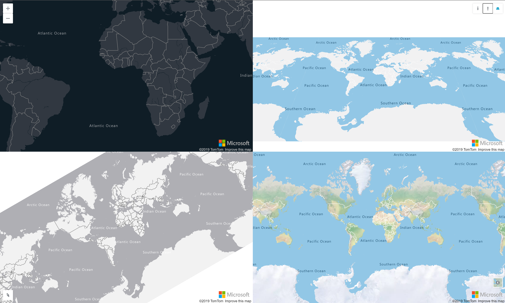

## Install the package

The package is available on npm. You need to install the dependencies to the azure-maps-* packages by yourself.

```
npm i --save azure-maps-control azure-maps-drawing-tools azure-maps-rest ng-azure-maps
```

## Register the module

An `AzureMapsModule` can be imported from the `ng-azure-maps` namespace. This class exposes a `forRoot` method which can be called by your angular module and where the configuration of the library can be given.

```
import { BrowserModule } from '@angular/platform-browser';
import { NgModule } from '@angular/core';

import { AppComponent } from './app.component';
import { AzureMapsModule } from 'ng-azure-maps';
import { environment } from '../environments/environment';

@NgModule({
  declarations: [
    AppComponent
  ],
  imports: [
    BrowserModule,
    AzureMapsModule.forRoot({
      authOptions: environment.authOptions
    })
  ],
  providers: [],
  bootstrap: [AppComponent]
})
export class AppModule { }
```

AAD and SubscriptionKey authentication are supported.

## How to

Please note that all the directives can be used either as html tag or applied to an html element as an attribute tag. For example, the map can be displayed using `<azure-map></azure-map>` or `<div azure-map></div>`.

## Display a map

Use the `azure-map` directive to display a map.

```
<azure-map></azure-map>
```

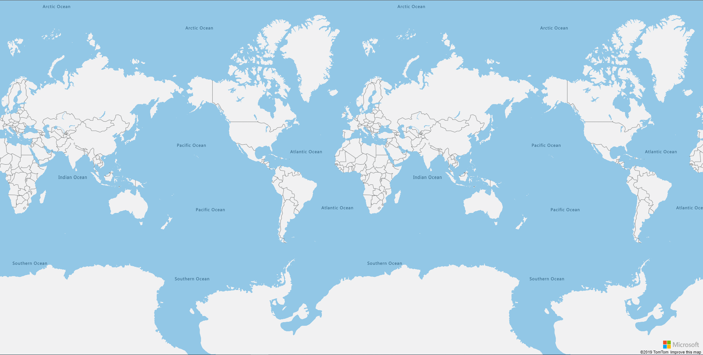 

You can specify different inputs on the `azure-map` directive to customize your display. Please refer to the [Azure Maps Web SDK Documentation](https://docs.microsoft.com/en-us/azure/azure-maps/map-create) for more information.

```
<azure-map [center]="[11.47, 48.18]" mapStyle='grayscale_dark'></azure-map>
```

NB: To avoid conflict with the `style` html tag, the style to apply to the map can be found under `mapStyle` instead. The same applied to the `type` of camera which has been renamed to `cameraType`.

```
<azure-map [center]="[11.47, 48.18]" mapStyle='grayscale_dark' [zoom]="10"></azure-map>
```

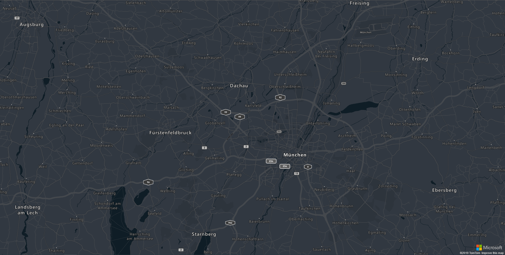 

For now, only the `ready` and `error` events are available as Output of the `azure-map` directive.

### React to events on the map

The map events are supported on the `azure-map` directive. In order to avoid conflicts with the names of some input (like pitch or zoom), every event starts with `on` and is followed by the key of the event in PascalCase. A parameter containing the `map` and the `event` is given to the method. 

The events and their description are defined on the following table.

| Native event key | azure-map event | Description |
| -- | -- | -- |
| `boxzoomend` | `onBoxZoomEnd` | Fired when a "box zoom" interaction ends. |
| `boxzoomstart` | `onBoxZoomStart` | Fired when a "box zoom" interaction starts. | 
| `click` | `onClick` | Fired when a pointing device is pressed and released at the same point on the map. |
| `contextmenu` | `onContextMenu` | Fired when the right button of the mouse is clicked. |
| `data` | `onData` | Fired when any map data loads or changes. |
| `dblclick` | `onDblClick` | Fired when a pointing device is clicked twice at the same point on the map. |
| `drag` | `onDrag` | Fired repeatedly during a "drag to pan" interaction on the map, popup, or HTML marker. |
| `dragend` | `onDragEnd` | Fired when a "drag to pan" interaction ends on the map, popup, or HTML marker. |
| `dragstart` | `onDragStart` | Fired when a "drag to pan" interaction starts on the map, popup, or HTML marker. |
| `error` | `onError` | Fired when an error occurs. |
| `idle` | `onIdle` | <p>Fired after the last frame rendered before the map enters an "idle" state:<ul><li>No camera transitions are in progress.</li><li>All currently requested tiles have loaded.</li><li>All fade/transition animations have completed.</li></ul></p> |
| `layeradded` | `onLayerAdded` | Fired after a layer has been added to the map |
| `layerremoved` | `onLayerRemoved` | Fired after a layer has been removed from the map |
| `load` | `onLoad` | Fired immediately after all necessary resources have been downloaded and the first visually complete rendering of the map has occurred.
| `mousedown` | `onMouseDown` | Fired when a pointing device is pressed within the map or when on top of an element. |
| `mouseleave` | `onMouseLeave` | Fired when a pointing device is moved out the map or an element. |
| `mousemove` | `onMouseMove` | Fired when a pointing device is moved within the map or an element. |
| `mouseout` | `onMouseOut` | Fired when a point device leaves the map's canvas our leaves an element. |
| `mouseover` | `onMouseOver` | Fired when a pointing device is moved over the map or an element. |
| `mouseup` | `onMouseUp` | Fired when a pointing device is released within the map or when on top of an element. |
| `move` | `onMove` | Fired repeatedly during an animated transition from one view to another, as the result of either user interaction or methods. |
| `moveend` | `onMoveEnd` | Fired just after the map completes a transition from one view to another, as the result of either user interaction or methods. |
| `movestart` | `onMoveStart` | Fired just before the map begins a transition from one view to another, as the result of either user interaction or methods. |
| `pitch` | `onPitch` | Fired whenever the map's pitch (tilt) changes as the result of either user interaction or methods. |
| `pitchend` | `onPitchEnd` | Fired immediately after the map's pitch (tilt) finishes changing as the result of either user interaction or methods. |
| `pitchstart` | `onPitchStart` | Fired whenever the map's pitch (tilt) begins a change as the result of either user interaction or methods. |
| `render` | `onRender` | <p>Fired whenever the map is drawn to the screen, as the result of:<ul><li>A change to the map's position, zoom, pitch, or bearing.</li><li>A change to the map's style.</li><li>A change to a `DataSource` source.</li><li>The loading of a vector tile, GeoJSON file, glyph, or sprite.</li></ul></p> |
| `ready` | `onReady` | Fired when the minimum required map resources are loaded before the map is ready to be programmatically interacted with. |
| `render` | `onRender` | Fired whenever the map is drawn to the screen, as the result of: |
| `resize` | `onResize` | Fired immediately after the map has been resized. |
| `rotate` | `onRotate` | Fired repeatedly during a "drag to rotate" interaction. |
| `rotateend` | `onRotateEnd` | Fired when a "drag to rotate" interaction ends. |
| `rotatestart` | `onRotateStart` | Fired when a "drag to rotate" interaction starts. |
| `sourcedata` | `onSourceData` | Fired when one of the map's sources loads or changes, including if a tile belonging to a source loads or changes. |
| `sourceadded` | `onSourceAdded` | Fired when a DataSource or VectorTileSource is added to the map. |
| `sourceremoved` | `onSourceRemoved` | Fired when a DataSource or VectorTileSource is removed from the map. |
| `styledata` | `onStyleData` | Fired when the map's style loads or changes. |
| `styleimagemissing` | `onStyleImageMissing` | Fired when a layer tries to load an image from the image sprite that doesn't exist |
| `tokenacquired` | `onTokenAcquired` | Fired when an AAD access token is obtained. |
| `touchcancel` | `onTouchCancel` | Fired when a touchcancel event occurs within the map. |
| `touchend` | `onTouchEnd` | Fired when a touchend event occurs within the map. |
| `touchmove` | `onTouchMove` | Fired when a touchmove event occurs within the map. |
| `touchstart` | `onTouchStart` | Fired when a touchstart event occurs within the map. |
| `wheel` | `onWheel` | Fired when a mouse wheel event occurs within the map. |
| `zoom` | `onZoom` | Fired repeatedly during an animated transition from one zoom level to another, as the result of either user interaction or methods. |
| `zoomend` | `onZoomEnd` | Fired just after the map completes a transition from one zoom level to another, as the result of either user interaction or methods. |
| `zoomstart` | `onZoomStart` | Fired just before the map begins a transition from one zoom level to another, as the result of either user interaction or methods. |

## Add controls

Compass, pitch, style and zoom controls have their own directive, each of them accepting a position binding.

```
<azure-map>
  <map-zoom-control position='top-left'></map-zoom-control>
  <map-pitch-control position="top-right"></map-pitch-control>
  <map-compass-control position="bottom-left"></map-compass-control>
  <map-style-control position="bottom-right"></map-style-control>
</azure-map>
```

 

## Traffic

Traffic options can be given to the `azure-map` using the `trafficOptions` input. Please refer to the [Azure Maps Documentation](https://docs.microsoft.com/en-us/azure/azure-maps/map-show-traffic) concerning the traffic options.

```
import { Component } from '@angular/core';
import * as atlas from 'azure-maps-control';

@Component({
  selector: 'app-root',
  template: '<azure-map [center]="[11.47, 48.18]" [zoom]="10" mapStyle="grayscale_light" [trafficOptions]="trafficOptions"></azure-map>',
  styleUrls: ['./app.component.scss']
})
export class AppComponent {

  trafficOptions: atlas.TrafficOptions = {
    flow: "relative",
    incidents: true
  };

}
```

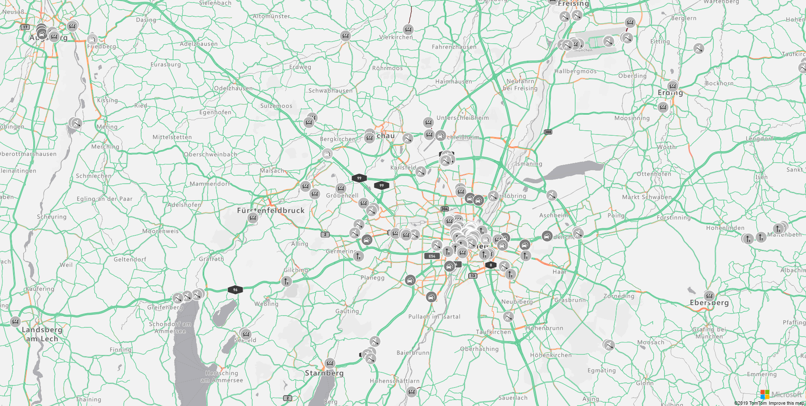

## HtmlMarkers

You can add HTML Markers to the map using the `map-html-marker` directive. Please refer to the [Azure Maps Documentation](https://docs.microsoft.com/en-us/azure/azure-maps/map-add-custom-html) concerning the available options. The map and the HTML Markers listen to the changes on the provided markers and will update them accordingly.

```
import { Component } from '@angular/core';

@Component({
  selector: 'app-root',
  template: '<azure-map (onReady)="mapReady()">' +
    '<map-html-marker *ngFor="let markerPosition of markerPositions" [position]="markerPosition" [draggable]="true" (onDrag)="reverseMove($event)">' +
    '</map-html-marker>' +
    '</azure-map>',
  styleUrls: ['./app.component.scss']
})
export class AppComponent {

  public markerPositions: [number, number][] = [];

  mapReady() {
    for (let i = 0; i < 10; i++) {
      this.markerPositions.push([i * 5, i * 5]);
    }
  }
  
  public reverseMove(markerEvent: IMarkerEvent) {
    markerEvent.marker.setOptions({
      position: [-markerEvent.event.target.options.position[0],-markerEvent.event.target.options.position[1]]
    });
  }
}
```

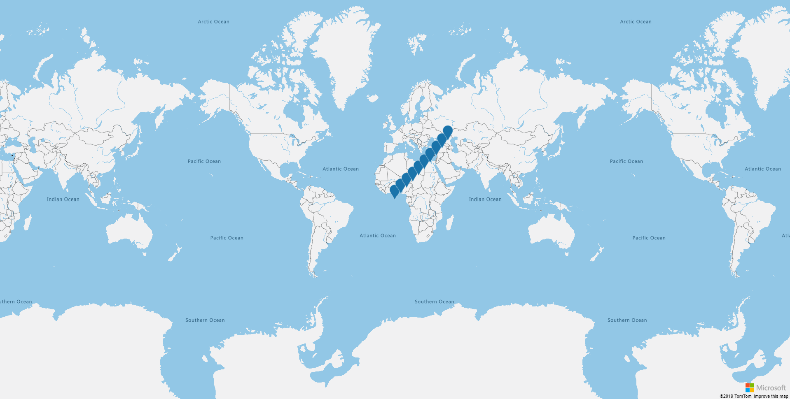 

### React to events on HTMLMarkers

The HTMLMarkers events are supported on the `map-html-marker` directive. Every event starts with `on` and is followed by the key of the event in PascalCase. A parameter containing the `htmlMarker` and the `event` is given to the method. 

Dragging events are triggered only if the HTMLMarker is set to `draggable: true`.

The events and their description are defined on the following table.

| Native event key | HTMLMarker event | Description |
| -- | -- | -- |
| `click` | `onClick` | Fired when a pointing device is pressed and released at the same point on the marker. |
| `contextmenu` | `onContextMenu` | Fired when the right button of the mouse is clicked on the marker. |
| `dblclick` | `onDblClick` | Fired when a pointing device is clicked twice at the same point on the marker. |
| `drag` | `onDrag` | Fired repeatedly during a "drag to pan" interaction on the HTML marker. |
| `dragend` | `onDragEnd` | Fired when a "drag to pan" interaction ends on the HTML marker. |
| `dragstart` | `onDragStart` | Fired when a "drag to pan" interaction starts on the HTML marker. |
| `keydown` | `onKeyDown` | Fired when key is pressed down on the HTML marker. |
| `keypress` | `onKeyPress` | Fired when key is pressed on the HTML marker. |
| `keyup` | `onKeyUp` | Fired when key is pressed up on the HTML marker. |
| `mousedown` | `onMouseDown` | Fired when a pointing device is pressed within the HTML marker or when on top of an element. |
| `mouseenter` | `onMouseEnter` | Fired when a pointing device is initially moved over the HTML marker or an element. |
| `mouseleave` | `onMouseLeave` | Fired when a pointing device is moved out the HTML marker or an element. |
| `mousemove` | `onMouseMove` | Fired when a pointing device is moved within the HTML marker or an element. |
| `mouseout` | `onMouseOut` | Fired when a point device leaves the HTML marker's canvas our leaves an element. |
| `mouseover` | `onMouseOver` | Fired when a pointing device is moved over the HTML marker or an element. |
| `mouseup` | `onMouseUp` | Fired when a pointing device is released within the HTML Marker or when on top of an element. |

## Drawing toolbar

The drawing toolbar can be added using the `map-drawing-toolbar` directive. 

The `drawingChanged`, `drawingChanging`, `drawingComplete`, `drawingModeChanged` and `drawingStarted` events are available as Output of the directive.

```
<azure-map>
  <map-drawing-toolbar position="top-right" toolbarStyle="dark"></map-drawing-toolbar>
</azure-map>
```

NB: To avoid conflict with the `style` html tag, the style to apply to the toolbar can be found under `toolbarStyle` instead.

Please refer to the [Azure Maps Documentation](https://docs.microsoft.com/en-us/azure/azure-maps/map-add-drawing-toolbar) for customization and events.

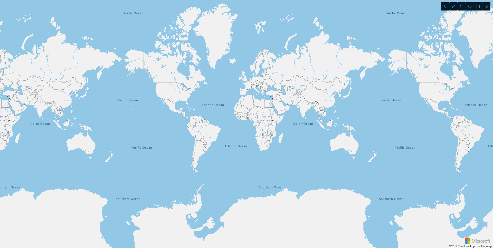 

## Layers

The layers are directly linked to the map and one of its datasources. A data source can be added directly as a binding on the `azure-map` directive.

```
<azure-map [dataSources]="[dataSource, dataSourceRed]"></azure-map>
```

### Symbol Layers

A symbol layer can be added using the `map-symbol-layer` directive. The id of the data source to display on the layer can be specified on the `dataSourceId` binding on the directive.

For more information on the customization of the layer, please refer to the [Azure Maps Documentation](https://docs.microsoft.com/en-us/azure/azure-maps/map-add-pin).

```
import { Component } from '@angular/core';
import * as atlas from 'azure-maps-control';

@Component({
  selector: 'app-root',
  template: '<azure-map zoom="2" [dataSources]="[dataSource, dataSourceRed]" (onReady)="mapReady()">' +
    '<map-symbol-layer dataSourceId="blue"></map-symbol-layer>' +
    '<map-symbol-layer dataSourceId="red" [iconOptions]="redIconOptions"></map-symbol-layer>' +
    '</azure-map>',
  styleUrls: ['./app.component.scss']
})
export class AppComponent {

  public dataSource: atlas.source.DataSource;
  public dataSourceRed: atlas.source.DataSource;

  public redIconOptions: atlas.IconOptions = {
    image: 'pin-red'
  };

  mapReady() {
    this.dataSource = new atlas.source.DataSource('blue');
    this.dataSourceRed = new atlas.source.DataSource('red');
    for (let i = 0; i < 10; i++) {
      const point = new atlas.Shape(new atlas.data.Point([i * 5, i * 5]));
      this.dataSource.add([point]);
      const redPoint = new atlas.Shape(new atlas.data.Point([i * -5, i * 5]));
      this.dataSourceRed.add([redPoint]);
    }
  }

}
```

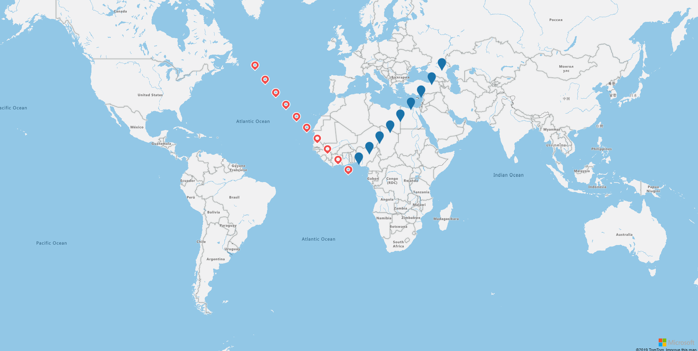

### Bubble layers

A bubble layer can be added using the `map-bubble-layer` directive. The id of the data source to display on the layer can be specified on the `dataSourceId` binding on the directive.

For more information on the customization of the layer, please refer to the [Azure Maps Documentation](https://docs.microsoft.com/en-us/azure/azure-maps/map-add-map-bubble-layer).

```
import { Component } from '@angular/core';
import * as atlas from 'azure-maps-control';

@Component({
  selector: 'app-root',
  template: '<azure-map zoom="2" [dataSources]="[dataSource]" (onReady)="mapReady()">' +
    '<map-bubble-layer dataSourceId="source" [strokeColor]="strokeColor" [strokeWidth]="strokeWidth" [color]="color" [radius]="radius"></map-bubble-layer>' +
    '</azure-map>',
  styleUrls: ['./app.component.scss']
})
export class AppComponent {

  public dataSource: atlas.source.DataSource;
  public strokeColor = '#4288f7';
  public strokeWidth = 6;
  public radius = 5;
  public color = "white";

  mapReady() {
    this.dataSource = new atlas.source.DataSource('source');
    for (let i = 0; i < 10; i++) {
      const point = new atlas.Shape(new atlas.data.Point([i * 5, i * 5]));
      this.dataSource.add([point]);
    }
  }

}
```

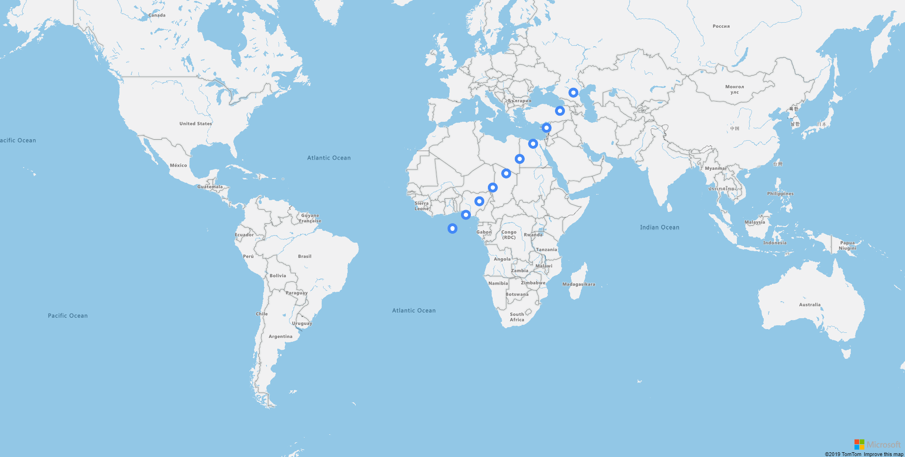

### Line layers

A line layer can be added using the `map-line-layer` directive. The id of the data source to display on the layer can be specified on the `dataSourceId` binding on the directive.

For more information on the customization of the layer, please refer to the [Azure Maps Documentation](https://docs.microsoft.com/en-us/azure/azure-maps/map-add-map-line-layer).

```
import { Component } from '@angular/core';
import * as atlas from 'azure-maps-control';

@Component({
  selector: 'app-root',
  template: '<azure-map [zoom]="zoom" [center]="center" [mapStyle]="mapStyle" [dataSources]="[dataSource]" (onReady)="mapReady()">' +
    '<map-line-layer dataSourceId="source" [strokeGradient]="strokeGradient" [strokeWidth]="strokeWidth"></map-line-layer>' +
    '</azure-map>',
  styleUrls: ['./app.component.scss']
})
export class AppComponent {

  public dataSource: atlas.source.DataSource;
  public strokeWidth = 6;
  public strokeGradient: atlas.Expression = [
    'interpolate',
    ['linear'],
    ['line-progress'],
    0, "blue",
    0.1, "royalblue",
    0.3, "cyan",
    0.5, "lime",
    0.7, "yellow",
    1, "red"
  ];

  public zoom = 14;
  public center = [11.581990, 48.143534];

  public mapStyle = "grayscale_dark";

  mapReady() {
    this.dataSource = new atlas.source.DataSource('source');
    this.dataSource.add(new atlas.data.LineString([
      [11.575454, 48.137392],
      [11.576029, 48.137094],
      [11.577248, 48.138912],
      [11.578434, 48.138737],
      [11.578826, 48.139409],
      [11.580140, 48.139179],
      [11.581237, 48.141555],
      [11.581155, 48.141852],
      [11.581990, 48.143534],
      [11.583355, 48.143896],
      [11.583662, 48.144258],
      [11.585458, 48.145596],
      [11.587910, 48.145779],
      [11.589632, 48.146608],
      [11.590771, 48.148219],
      [11.591979, 48.150743],
      [11.592885, 48.150611],
      [11.593161, 48.150874],
      [11.593594, 48.151084],
      [11.594028, 48.151803],
      [11.592281, 48.152074],
    ]));
  }

}
```

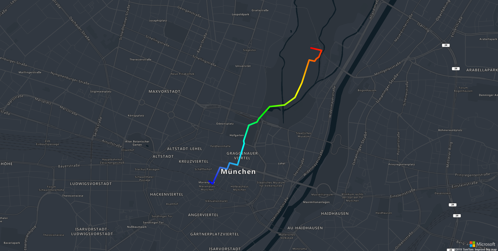

### Polyon layers

A polygon layer can be added using the `map-polygon-layer` directive. The id of the data source to display on the layer can be specified on the `dataSourceId` binding on the directive.

For more information on the customization of the layer, please refer to the [Azure Maps Documentation](https://docs.microsoft.com/en-us/azure/azure-maps/map-add-shape).

```
import { Component } from '@angular/core';
import * as atlas from 'azure-maps-control';

@Component({
  selector: 'app-root',
  template: '<azure-map [zoom]="zoom" [dataSources]="[dataSource]" (onReady)="mapReady()">' +
    '<map-polygon-layer dataSourceId="source" [fillColor]="fillColor" [fillOpacity]="fillOpacity"></map-polygon-layer>' +
    '</azure-map>',
  styleUrls: ['./app.component.scss']
})
export class AppComponent {

  public dataSource: atlas.source.DataSource;
  public fillOpacity = 0.5;
  public fillColor = '#1a73aa';

  public zoom = 2;

  mapReady() {
    this.dataSource = new atlas.source.DataSource('source');
    this.dataSource.add(new atlas.data.Polygon([
      [-50, -20],
      [0, 40],
      [50, -20],
      [-50, -20]
    ]));
  }

}
```

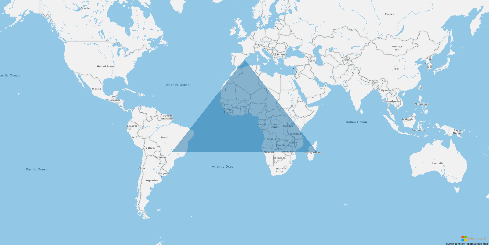

### Polyon extrusion layers

A polygon extrusion layer can be added using the `map-polygon-extrusion-layer` directive. The id of the data source to display on the layer can be specified on the `dataSourceId` binding on the directive.

For more information on the customization of the layer, please refer to the [Azure Maps Documentation](https://docs.microsoft.com/en-us/azure/azure-maps/map-extruded-polygon).

```
<azure-map [center]="[11.47, 48.18]" zoom="4" pitch="45" view="Auto" (onReady)="mapReady()" [dataSources]="[dataSource]">
  <map-polygon-extrusion-layer dataSourceId="source" [base]="base" [fillColor]="fillColor" [fillOpacity]="fillOpacity"
    [height]="height"></map-polygon-extrusion-layer>
  <div class="legend">
    Population Density (people/km<sup>2</sup>)
    <p>
      <i [style.background]="defaultColor"></i> 0-{{colorScale[0]}}
    </p>
    <p *ngFor="let legendItem of legend">
      <i [style.background]="legendItem.color"></i> {{legendItem.label}}
    </p>
  </div>
</azure-map>
```

```
import { Component } from '@angular/core';
import * as atlas from 'azure-maps-control';

@Component({
  selector: 'app-root',
  templateUrl: './app.component.html',
  styleUrls: ['./app.component.scss']
})
export class AppComponent {

  public dataSource: atlas.source.DataSource;
  public readonly defaultColor = '#00ff80';
  public readonly colorScale: any = [
    10, '#09e076',
    20, '#0bbf67',
    50, '#f7e305',
    100, '#f7c707',
    200, '#f78205',
    500, '#f75e05',
    1000, '#f72505',
    10000, '#6b0a05'
  ];

  public get legend(): { color: string, label: string }[] {
    const result = [];
    for (let i = 0; i < this.colorScale.length; i += 2) {
      result.push({ color: this.colorScale[i + 1], label: this.colorScale[i + 2] ? `${this.colorScale[i]} - ${this.colorScale[i + 2]}` : `${this.colorScale[i]} +` });
    }
    return result;
  }

  public fillColor: any = [
    'step',
    ['get', 'DENSITY'],
    this.defaultColor
  ].concat(this.colorScale);

  public height: any = [
    'interpolate',
    ['linear'],
    ['get', 'DENSITY'],
    0, 100,
    1200, 960000
  ];

  public base = 100;
  public fillOpacity = 0.7;

  mapReady() {
    this.dataSource = new atlas.source.DataSource('source');
    this.dataSource.importDataFromUrl('https://raw.githubusercontent.com/arnaudleclerc/ng-azure-maps/master/assets/data/countries.geojson.json');
  }

}
```

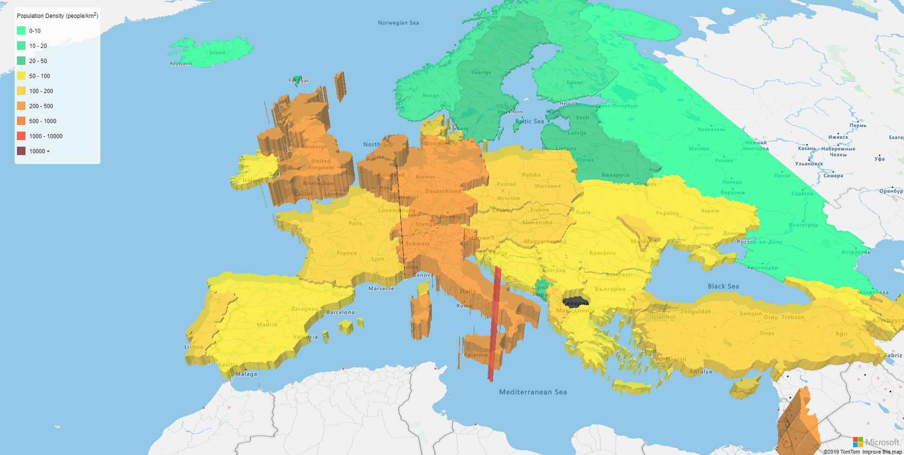

### Heatmap layers

A heatmap layer can be added using the `map-heatmap-layer` directive. The id of the data source to display on the layer can be specified on the `dataSourceId` binding on the directive.

For more information on the customization of the layer, please refer to the [Azure Maps Documentation](https://docs.microsoft.com/en-us/azure/azure-maps/map-add-heat-map-layer).

```
import { Component } from '@angular/core';
import * as atlas from 'azure-maps-control';

@Component({
  selector: 'app-root',
  template: '<azure-map zoom="2" [mapStyle]="mapStyle" (onReady)="mapReady()" [dataSources]="[dataSource]">' +
    '<map-heatmap-layer [weight]="weight" [radius]="radius" dataSourceId="source"></map-heatmap-layer>' +
    '</azure-map>',
  styleUrls: ['./app.component.scss']
})
export class AppComponent {

  public dataSource: atlas.source.DataSource;
  public mapStyle = "grayscale_dark";
  public weight: any = ['get', 'Confirmed'];
  public radius = 20;

  mapReady() {
    this.dataSource = new atlas.source.DataSource('source');
    this.dataSource.importDataFromUrl('https://services1.arcgis.com/0MSEUqKaxRlEPj5g/arcgis/rest/services/ncov_cases/FeatureServer/1/query?where=1%3D1&f=geojson&outFields=*');
  }

}
```

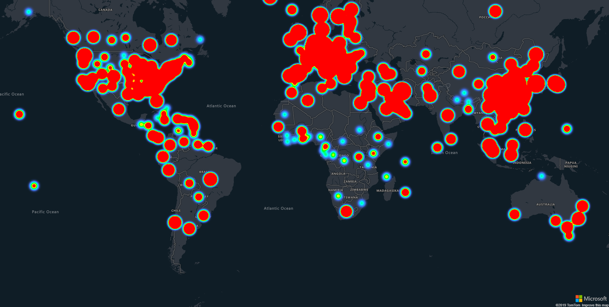

### Image layers

An image layer can be added using the `map-image-layer` directive.

For more information on the customization of the layer, please refer to the [Azure Maps Documentation](https://docs.microsoft.com/en-us/azure/azure-maps/map-add-map-image-layer).

```
import { Component } from '@angular/core';

@Component({
  selector: 'app-root',
  template: '<azure-map [center]="[11.575454, 48.137392]" zoom="13">' +
    '<map-image-layer url="https://ngazuremaps.blob.core.windows.net/images/munich_1858.jpg" [coordinates]="coordinates">' +
    '</map-image-layer>' +
    '</azure-map>',
  styleUrls: ['./app.component.scss']
})
export class AppComponent {
  public coordinates = [
    [11.540774, 48.151994],
    [11.598952, 48.151994],
    [11.598952, 48.127172],
    [11.540774, 48.127172]
  ]
}
```


### Tile layers

A tile layer can be added using the `map-tile-layer` directive.

For more information on the customization of the layer, please refer to the [Azure Maps Documentation](https://docs.microsoft.com/en-us/azure/azure-maps/map-add-tile-layer).

```
import { Component } from '@angular/core';

@Component({
  selector: 'app-root',
  template: '<azure-map [center]="[-99.47, 40.75]" zoom="4">' +
    '<map-tile-layer tileUrl="https://mesonet.agron.iastate.edu/cache/tile.py/1.0.0/nexrad-n0q-900913/{z}/{x}/{y}.png">' +
    '</map-tile-layer>' +
    '</azure-map>',
  styleUrls: ['./app.component.scss']
})
export class AppComponent {

}
```

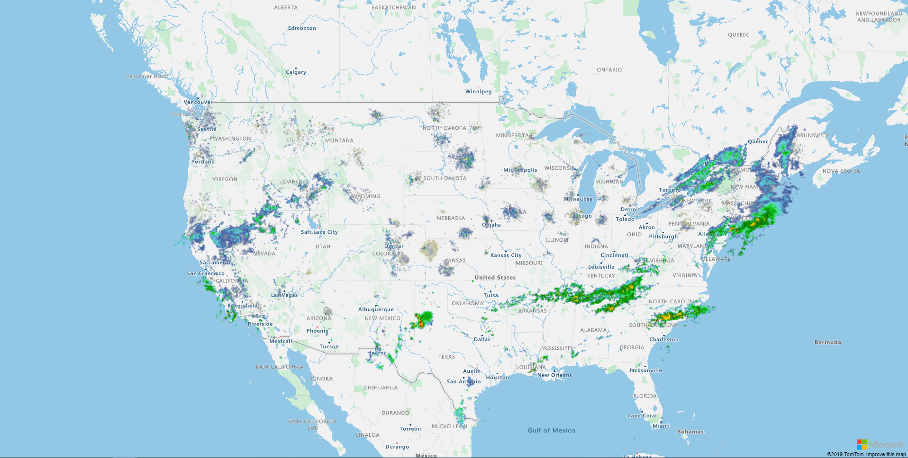

### React to events on a layer

The layer events are supported on all `*-layer` directives. Every event starts with on and is followed by the key of the event in PascalCase. A parameter containing the layer and the event is given to the method.

The heatmap and tile layers support only onAdded and onRemoved events.

The events and their description are defined on the following table.

| Native event key | azure-layer event | Description |
| -- | -- | -- |
| `click` | `onClick` | Fired when a pointing device is pressed and released at the same point on the layer. |
| `contextmenu` | `onContextMenu` | Fired when the right button of the mouse is clicked. |
| `dblclick` | `onDblClick` | Fired when a pointing device is clicked twice at the same point on the layer. |
| `layeradded` | `onAdded` | Fired when the layer is added to the map. |
| `layerremoved` | `onRemoved` | `Fire when the layer has been removed from the map. |
| `mousedown` | `onMouseDown` | Fired when a pointing divice is pressed within the layer or on top of an element. |
| `mouseenter` | `onMouseEnter` | Fired when a pointing device is initially moved over the layer or an element. |
| `mouseleave` | `onMouseLeave` | Fired when a pointing device is moved out of the layer or an element. |
| `mousemove` | `onMouseMove` | Fired when a pointing device is moving within the layer or an element. |
| `mouseout` | `onMouseOut` | Fired when a pointing device leaves the layer's canvas or leaves an element. |
| `mouseover` | `onMouseOver` | Fired when a pointing device is moved over the layer or an element. |
| `mouseup` | `onMouseUp` | Fired when a pointing divice is released within the layer or on top of an element. |
| `touchcancel` | `onTouchCancel` | Fired when a touchcancel event occurs within the layer. |
| `touchend` | `onTouchEnd` | Fired when a touchend event occurs within the layer. |
| `touchmove` | `onTouchMove` | Fired when a touchmove event occurs within the layer. |
| `touchstart` | `onTouchStart` | Fired when a touchstart event occurs within the layer. |
| `wheel` | `onWheel` | Fired when a mouse wheel event occurs within the layer. |

## Search

You can consume the Search Service REST APIs using the SearchService. For now, only the subscription key authentication is supported. 

```
import { Component } from '@angular/core';
import { SearchService, IMapEvent } from 'ng-azure-maps';
import * as atlas from 'azure-maps-control';

@Component({
  selector: 'app-root',
  template: '<azure-map mapStyle="grayscale_dark" [dataSources]="[dataSource]" (onReady)="mapReady($event)">' +
    '<map-symbol-layer dataSourceId="search" [iconOptions]="iconOptions"></map-symbol-layer>' +
    '</azure-map>',
  styleUrls: ['./app.component.scss']
})
export class AppComponent {

  public dataSource: atlas.source.DataSource;

  public iconOptions: atlas.IconOptions = {
    image: 'beer',
    size: 0.2
  };

  constructor(private readonly searchService: SearchService) {
  }

  mapReady(event: IMapEvent) {
    event.map.imageSprite.add('beer', 'https://cdn0.iconfinder.com/data/icons/small-n-flat/24/678063-beer-128.png').then(() => {
      this.dataSource = new atlas.source.DataSource('search');
      this.searchService.searchFuzzy("Biergarten", {
        lat: 48.143534,
        lon: 11.581990,
        radius: 100000
      }).then(results => {
        const features = results.geojson.getFeatures();
        this.dataSource.add(features);
        event.map.setCamera({
          bounds: features.bbox,
          padding: 35
        });
      });
    });
  }

}
```

For more information on how to search with Azure Maps, please refer to the [documentation](https://docs.microsoft.com/en-us/azure/azure-maps/map-search-location) 

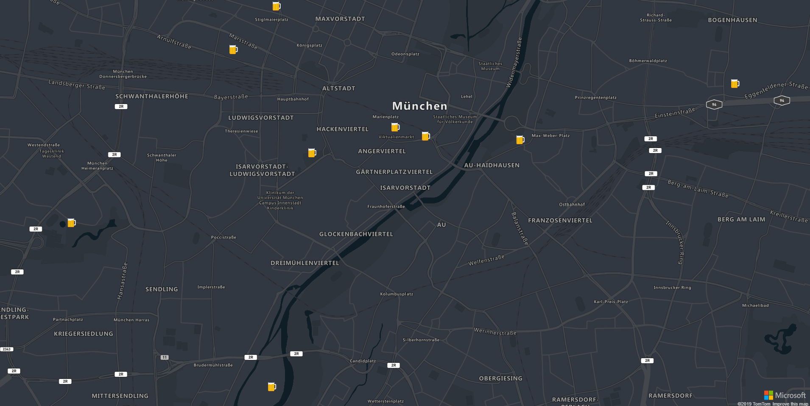

## Routes

You can use the `RouteService` to query for routes and directions. The following sample shows how to integrate directions on a map with traffic information. For more information, please refer to the [Azure Maps Documentation](https://docs.microsoft.com/en-us/azure/azure-maps/map-route).

```
import { Component } from '@angular/core';
import { IMapEvent, RouteService, } from 'ng-azure-maps';
import * as rest from 'azure-maps-rest';
import * as atlas from 'azure-maps-control';

@Component({
  selector: 'app-root',
  template: '<azure-map [trafficOptions]="trafficOptions" (onClick)="mapClick($event)" [center]="center" [zoom]="zoom" cursor="pointer" [dataSources]="[route]">' +
    '<map-html-marker *ngFor="let point of points" [position]="point"></map-html-marker>' +
    '<map-line-layer dataSourceId="route" [strokeWidth]="strokeWidth"></map-line-layer>' +
    '</azure-map>',
  styleUrls: ['./app.component.scss']
})
export class AppComponent {

  public trafficOptions: atlas.TrafficOptions = {
    flow: "relative",
    incidents: true
  };

  public points: [number, number][] = [];
  public route = new atlas.source.DataSource('route');
  public zoom = 10;
  public center = [11.581990, 48.143534];
  public strokeWidth = 6;

  constructor(private readonly routeService: RouteService) { }

  mapClick(mapEvent: IMapEvent) {
    if (this.points.length === 2) {
      this.points.length = 0;
    }

    this.route.clear();
    this.points.push(mapEvent.event.position);

    if (this.points.length === 2) {
      this.routeService.calculateRouteDirections(this.points, {
        routeType: rest.Models.RouteType.Shortest,
        traffic: true
      }).then(result => {
        const features = result.geojson.getFeatures();
        this.route.add(features.features);
        mapEvent.map.setCamera({
          bounds: features.bbox,
          padding: 35
        });
      });
    }
  }

}
```


## Popups

You can add Popups to the map using the map-popup directive. Please refer to the [Azure Maps Documentation](https://docs.microsoft.com/en-us/azure/azure-maps/map-add-popup) concerning the available options. The map and the popups listen to the changes on the provided markers and will update them accordingly.

```
import { Component } from '@angular/core';
import { IMapEvent } from 'ng-azure-maps';

@Component({
  selector: 'app-root',
  template: '<azure-map (onClick)="clickedMap($event)">' +
    '<map-popup [content]="content" [position]="popupPosition" [opened]="opened" (onClose)="closed()"></map-popup>'+
    '<map-html-marker [position]="fixedPosition" (onMouseOver)="enterMarker()" (onMouseLeave)="leaveMarker()"></map-html-marker>' +
    '<map-popup [content]="fixedPopupContent" [position]="fixedPosition" [closeButton]="false" [pixelOffset]="[0,-36]" '+
      '[fillColor]="\'rgba(0,0,0,0.8)\'" [opened]="fixedPopupOpened"></map-popup>'+
    '</azure-map>',
  styleUrls: ['./app.component.scss']
})
export class AppComponent {

  private popupTemplate = '<div class="infobox"><b>Coordinates</b><br>Longitude: {longitude}<br>Latitude: {latitude}</div>';

  public content: string;
  public popupPosition: [number, number];
  public opened: boolean;

  public fixedPosition: [number, number] = [0, 50];
  public fixedPopupContent: string = '<span class="infobox-2">Shows on mouse over<span>';
  public fixedPopupOpened: boolean;

  enterMarker(): void {
    this.fixedPopupOpened = true;
  }
  
  leaveMarker(): void {
    this.fixedPopupOpened = false;
  }

  clickedMap(clickEvent: IMapEvent): void {
    this.popupPosition = clickEvent.event.position;
    this.popupPosition[0].toFixed(3)
    this.content = this.popupTemplate.replace(/{longitude}/g, this.popupPosition[0].toFixed(3)).replace(/{latitude}/g, this.popupPosition[1].toFixed(3))
    this.opened = true;
  }

  closed(): void {
    this.opened = false;
  }
}
```

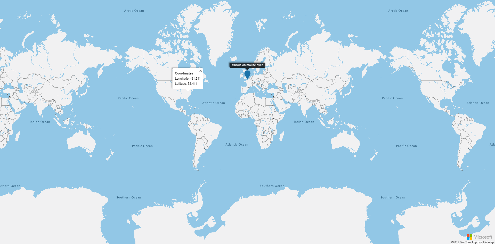

### React to events on the popup

The popup events are supported on the `map-popup` directive. Every event starts with `on` and is followed by the key of the event in PascalCase. A parameter containing the `popup` and the `event` is given to the method. 

The events and their description are defined on the following table.

| Native event key | popup event | Description |
| -- | -- | -- |
| `close` | `onBoxZoomEnd` | Fired when the popup closes. |
| `drag` | `onDrag` | Fired repeatedly during a "drag to pan" interaction on the popup. |
| `dragend` | `onDragEnd` | Fired when a "drag to pan" interaction ends on the popup. |
| `dragstart` | `onDragStart` | Fired when a "drag to pan" interaction starts on popup. |
| `open` | `onOpen` | Fired when the popup opens. |
